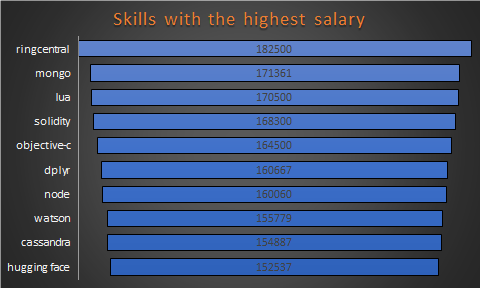
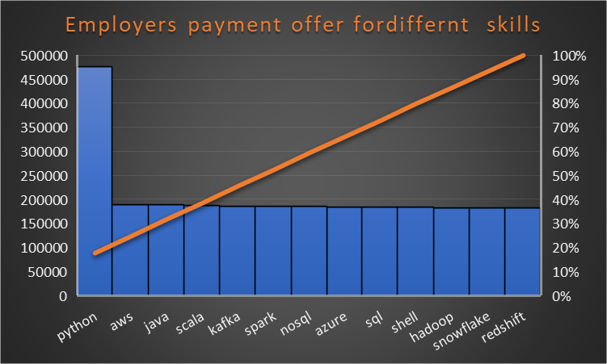

# Introduction
This is a deep dive into the job market and skills required for each job. Here we will be looking at specificaly Data and Analytics driven jobs of high demand and high salary.

SQL queries? check it out here 👉 [project_sql](/project_sql/)
# Background
This is the quest to make for looking for jobs much easier, the analysis will help job seekers to narrow down their skill the the job they desire then apply to those companies it there is an opening.

## questioned asked
- What are the top 20 demand skill for data analysis.
- What are the top 20 skill by salary of data analysist roles or data related roles.
- What are the top 20 paying jobs for data analysis or data related roles.
- What are the skills for top 20 paying jobs for data analysis or data related roles.
- What are the must optimum skills to learn for data driven roles.

# Tools Used
several tools where used in analysing this data, the tools are the best in this field for deep diving and collecting insite from a data set.

## Tools used:

**SQL:**
SQL was used as the tool for quering the data set, sql provided the best insite on this data set. Using sql allowed me to fuuly manipulate the data and analyse complex data to give out the best information.

**Postgres:**
Postgres was used as the database mangement system, ideal for handling job postings data ssets.

**VScode:**
Visual studio code was used as it is good for handling a wild varity of programming languages including SQL Visualization.

**Git and GitHub:**
Good for version control and ease in sharing my code to the public or partners ensuring efficient project tracking.

# The Analysis
each query looks at a specific aspect of the data driven role jobs and skills.

How i approached each question.
### Top 20 paying data analysis job
Here the data analysis jobs  were filtered according to health insurance  annual salary and remote jobs status; specifically working from home.
````sql
SELECT 
  job_id,
  job_title_short,
  job_schedule_type,
  job_no_degree_mention,
  job_health_insurance,
  job_country,
  job_work_from_home,
  salary_year_avg
FROM job_postings_fact
WHERE job_health_insurance = 'true'
  AND salary_year_avg IS NOT NULL
  AND job_work_from_home = 'true'
ORDER BY salary_year_avg DESC
LIMIT 20;
````
### Skills required for these type of job roles
Here we looked at the top skills job seekers must have to be able to apply for data driven roles.
````sql
WITH top_20_paying_jobs AS (
  SELECT job_id,
    company_dim.company_id,
    job_title_short,
    job_schedule_type,
    job_no_degree_mention,
    job_health_insurance,
    job_country,
    job_work_from_home,
    salary_year_avg
  FROM job_postings_fact
    LEFT JOIN company_dim ON job_postings_fact.company_id = company_dim.company_id
  WHERE job_health_insurance = 'true'
    AND salary_year_avg IS NOT NULL
    AND job_work_from_home = 'true'
  ORDER BY salary_year_avg DESC
  LIMIT 20
)
SELECT top_20_paying_jobs.*,
  skills_job_dim.skill_id,
  skills_dim.skills
FROM top_20_paying_jobs
  INNER JOIN skills_job_dim ON top_20_paying_jobs.job_id = skills_job_dim.job_id
  INNER JOIN skills_dim ON skills_job_dim.skill_id = skills_dim.skill_id
LIMIT 20;
````
### Top in demand skills for data driven job roles
After looking at the skills required for these type of roles, further analysis was conducted to find out among those skills which are are highly demanded by employers.
````sql
SELECT skills_dim.skills,
  count (job_postings_fact.job_id) AS top_demand_skill
FROM job_postings_fact
  INNER JOIN skills_job_dim ON job_postings_fact.job_id = skills_job_dim.job_id
  INNER JOIN skills_dim ON skills_job_dim.skill_id = skills_dim.skill_id
WHERE job_postings_fact.job_title_short LIKE '%Data%'
  OR job_postings_fact.job_title_short LIKE '%Analyst%'
GROUP BY skills
ORDER BY top_demand_skill DESC
LIMIT 5;
````
### Skills with the highest salary structure
We looked at the skills that has the highest payout.
````sql
SELECT skills_dim.skills,
  ROUND (avg(job_postings_fact.salary_year_avg)) AS avg_salary
FROM job_postings_fact
  INNER JOIN skills_job_dim ON job_postings_fact.job_id = skills_job_dim.job_id
  INNER JOIN skills_dim ON skills_job_dim.skill_id = skills_dim.skill_id
WHERE (
    job_postings_fact.job_title_short LIKE '%Data%'
    OR job_postings_fact.job_title_short LIKE '%Analyst%'
  )
  AND salary_year_avg IS NOT NULL
GROUP BY skills
ORDER BY avg_salary DESC
LIMIT 10;
````
### Optimum skills to learn
Knowing the highest skill by payout is good, but understanding which skill that will give you bettr satisfaction is better. The study looked int which skills will give you better chances of bein highered by employers. The code analysed the data set to find which skills are in high demand and also give out high payout.
````sql
SELECT COUNT (job_postings_fact.job_id) AS job_id_count,
  skills_job_dim.skill_id,
  skills_dim.skills,
  company_dim.name,
  ROUND (AVG(job_postings_fact.salary_year_avg)) AS job_demand_pament
FROM job_postings_fact
  INNER JOIN skills_job_dim ON job_postings_fact.job_id = skills_job_dim.job_id
  INNER JOIN skills_dim ON skills_job_dim.skill_id = skills_dim.skill_id
  INNER JOIN company_dim ON job_postings_fact.company_id = company_dim.company_id
WHERE job_postings_fact.salary_year_avg IS NOT NULL
GROUP BY skills_job_dim.skill_id,
  company_dim.name,
  skills_dim.skills
ORDER BY job_id_count DESC,
  job_demand_pament DESC
LIMIT 15;
````
**Visual breake down of the analysis**

-  Skills with highest pay: the top 10 skills sala ranges from $15200 - $18250.


- Highest payments offered by employers to a given skill.




# Job Skills Overview

This document outlines the top job titles, their associated skills, and relevant details.

## Job Listings

| Job Title                 | Schedule Type | Country       | Avg Salary ($) | Skills                          |
|---------------------------|---------------|---------------|----------------|---------------------------------|
| Data Scientist             | Full-time     | Sudan         | 320,000        | azure, aws, tensorflow, keras, pytorch, scikit-learn, datarobot |
| Machine Learning Engineer   | Full-time     | United States  | 300,000        | python, typescript, golang      |
| Data Scientist             | Full-time     | United States  | 300,000        | scala, java, spark, tensorflow, pytorch, kubernetes |
| Data Scientist             | Full-time     | United States  | 265,000        | python, tensorflow, pytorch      |
| Data Scientist             | Full-time     | Sudan         | 265,000        | python                           |

## Skills Breakdown

- **Azure**
- **AWS**
- **TensorFlow**
- **Keras**
- **PyTorch**
- **Scikit-learn**
- **DataRobot**
- **Python**
- **TypeScript**
- **Golang**
- **Scala**
- **Java**
- **Spark**
- **Kubernetes**

# Job Overview

This document outlines the top job titles, their schedule types, countries, and average salaries.

## Job Listings

| Job Title                | Schedule Type | Country       | Avg Salary ($) |
|--------------------------|---------------|---------------|-----------------|
| Data Scientist            | Full-time     | United States  | 351,500         |
| Data Scientist            | Full-time     | United States  | 324,000         |
| Data Scientist            | Full-time     | Sudan         | 320,000         |
| Data Scientist            | Full-time     | United States  | 313,000         |
| Senior Data Scientist     | Full-time     | United States  | 310,000         |
| Machine Learning Engineer  | Full-time     | United States  | 300,000         |
| Data Scientist            | Full-time     | United States  | 300,000         |
| Data Scientist            | Full-time     | Sudan         | 275,000         |
| Senior Data Scientist     | Full-time     | United States  | 265,119         |
| Data Scientist            | Full-time     | United States  | 265,000         |
| Data Scientist            | Full-time     | Sudan         | 265,000         |
| Data Scientist            | Full-time     | United States  | 265,000         |
| Data Scientist            | Full-time     | United States  | 262,500         |
| Data Analyst              | Full-time     | United States  | 255,829.5       |
| Data Scientist            | Full-time     | United States  | 253,500         |
| Data Engineer             | Full-time     | United States  | 251,000         |
| Data Engineer             | Full-time     | United States  | 250,000         |
| Data Scientist            | Full-time     | Sudan         | 250,000         |
| Data Scientist            | Full-time     | United States  | 250,000         |
| Data Engineer             | Full-time     | United States  | 250,000         |

# Skills in Demand

This document outlines the top skills currently in demand in the job market.

## Top Skills

| Skill   | Demand Score |
|---------|--------------|
| SQL     | 367,649      |
| Python  | 353,763      |
| AWS     | 128,377      |
| R       | 128,099      |
| Tableau  | 124,884      |

# Top Skills by Salary

This document outlines the top skills ranked by average salary.

## Skills and Salaries

| Skill          | Average Salary ($) |
|----------------|---------------------|
| RingCentral     | 182,500             |
| Mongo           | 171,361             |
| Lua             | 170,500             |
| Solidity        | 168,300             |
| Objective-C     | 164,500             |
| dplyr           | 160,667             |
| Node            | 160,060             |
| Watson          | 155,779             |
| Cassandra       | 154,887             |
| Hugging Face    | 152,537             |

# Optimum Skills to Learn

This document outlines the top skills to learn based on job demand and average payment.

## Skills Overview

| Skill     | Company                      | Job Demand Payment ($) |
|-----------|------------------------------|------------------------|
| AWS       | Capital One                  | 189,580                |
| Python    | Capital One                  | 188,676                |
| Scala     | Capital One                  | 186,972                |
| Java      | Capital One                  | 188,636                |
| Spark     | Capital One                  | 185,549                |
| Snowflake | Capital One                  | 182,964                |
| Azure     | Capital One                  | 184,523                |
| Python    | Booz Allen Hamilton          | 115,975                |
| Redshift  | Capital One                  | 182,364                |
| NoSQL     | Capital One                  | 185,236                |
| Shell     | Capital One                  | 184,094                |
| Kafka     | Capital One                  | 185,817                |
| SQL       | Capital One                  | 184,414                |
| Python    | Harnham                      | 170,610                |
| Hadoop    | Capital One                  | 183,115                |

# What I Learned
- This analysis chanllenged me on my analytical skills and after conducting this study i relized that my analytical skills has improve.
- My SQL skills has equally improve and i am confident tat i can take on any problem and solve it with sql effectively.

# Conclusion


The analysis of current job skills highlights significant trends in the job market, particularly in terms of salary and employer payment offers.

## Key Insights

1. **Top Earning Skills**: 
   - The skills associated with the highest average salaries are predominantly in fields such as cloud computing and programming languages. Notably, **RingCentral** leads with an impressive average salary of **$182,500**, followed closely by **Mongo** and **Lua**.
   - Skills like **Solidity**, **Objective-C**, and **dplyr** also command high salaries, indicating the value placed on specialized knowledge in these areas.

2. **Employer Payment Offers**:
   - The second chart illustrates employer payment offers for various skills, with **Python** and **AWS** leading the demand. The payment offers for these skills significantly exceed those for others, indicating a strong market demand.
   - Skills such as **Java**, **Scala**, and **Kafka** are also valued, though they do not reach the same payment levels as Python and AWS.

## Recommendations

- **Skill Development**: Aspiring professionals should focus on learning high-demand skills like Python and AWS, as they not only have the highest employer payment offers but also a broad applicability across various industries.
- **Continuous Learning**: As the job market evolves, keeping up with emerging technologies and skills will be critical. Skills like **RingCentral**, **Mongo**, and newer programming languages should be part of ongoing education and training.

By aligning skill development with market demand, individuals can enhance their employability and earning potential in a competitive job landscape.